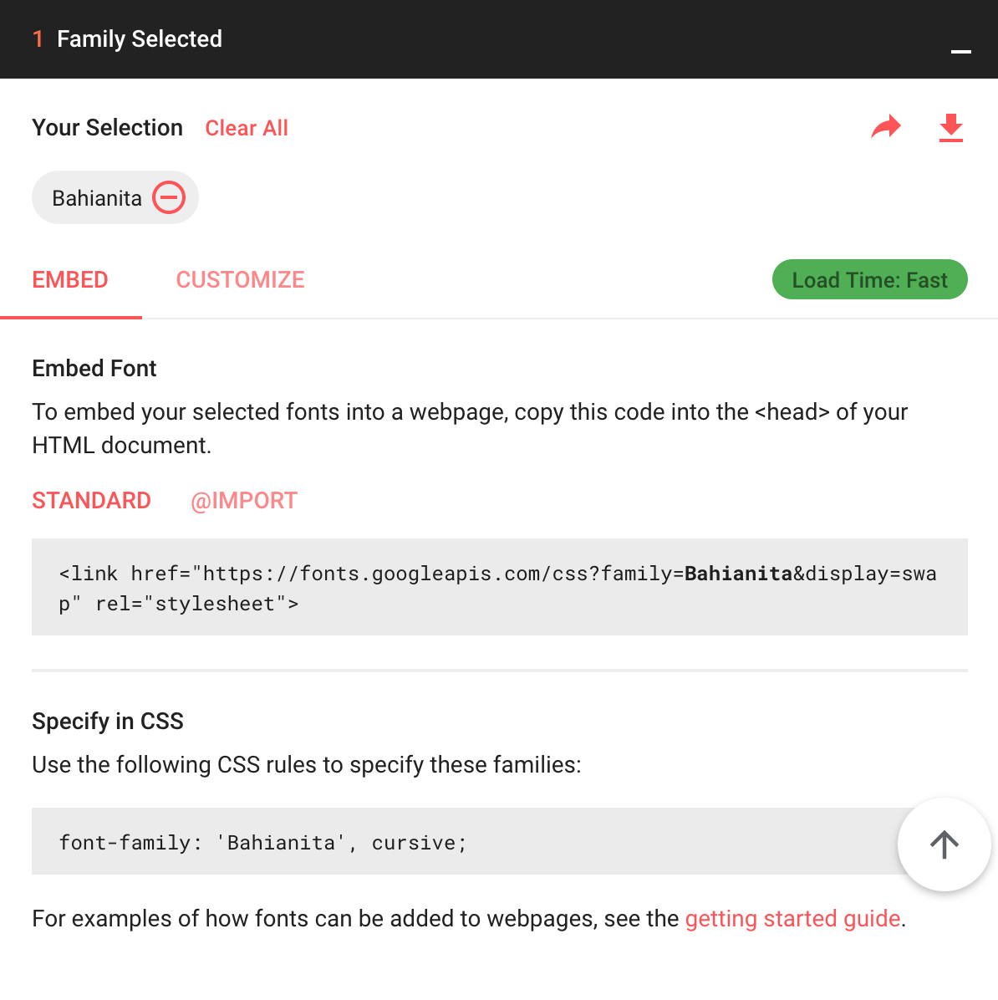

# How to add a google font
- Go to https://fonts.google.com/
- Pick your favorite font
- Click the red plus sign
- Expand the black bar that says "1 Family Selected"
        
- Copy the `<link>` tag
- Paste the `<link>` tag inside your `<head>` of your `index.html`. It will look something like this
          
            <head>
              <title>Home</title>
              <link href="https://fonts.googleapis.com/css?family=Bahianita&display=swap" rel="stylesheet">
              
              <link href="style.css" rel="stylesheet" type="text/css" />
              
            </head>
  - Copy the CSS code from the pop up like the screenshot above and use it in your css. For example:
        
        body {
          font-family: 'Bahianita', cursive;
        }
        
        
